## **CentOS 6.5 云康环境搭建**
```
版本号： V2.0
撰写人： 张文博
日期： 2016.08.08
```

## 一、设置项目文件夹
1. 将 `yunkang.tgz` 拷贝到桌面
2. 点击鼠标右键，打开 Terminal

```bash
sudo mkdir /home/www/ # 创建项目文件夹
sudo mv ryunkang.tgz /home/www/ # 移动到www目录
```
3. 创建 mysql , `sudo yum install mysql-server`

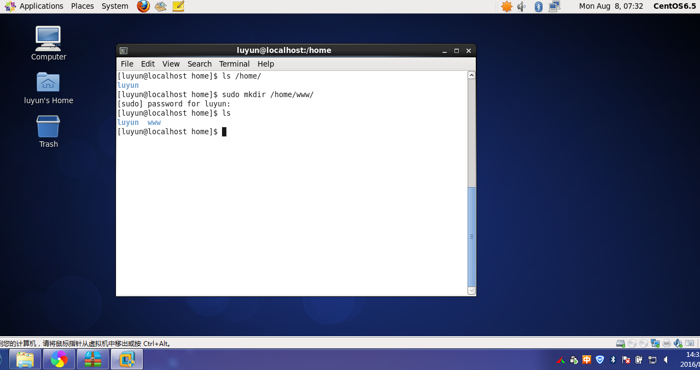

## 二、安装 Ruby 环境
```bash
curl -sSL https://rvm.io/mpapis.asc | gpg --import # 安装公钥

curl -L https://get.rvm.io | bash -s stable # 安装Rvm

# 载入RVM环境并获取需要的支持安装包
source /etc/profile.d/rvm.sh
rvm requirements

# 安装 Ruby
rvm install 2.2.3
rvm use 2.2.3 --default

gem sources --remove https://rubygems.org/
gem sources -a https://ruby.taobao.org/ # 切换gem源为淘宝
```

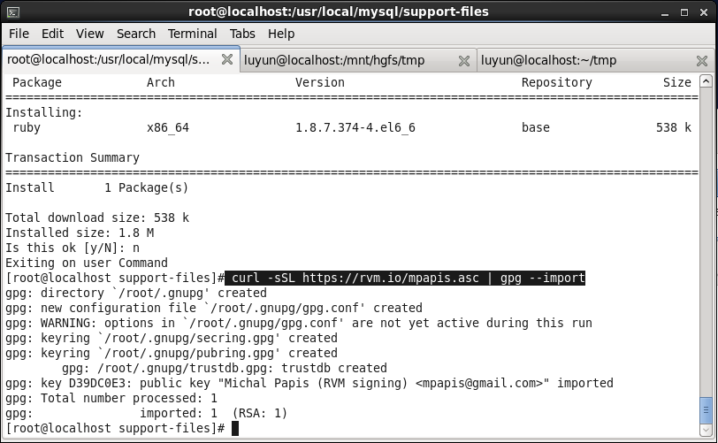

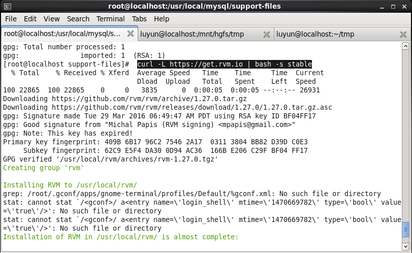


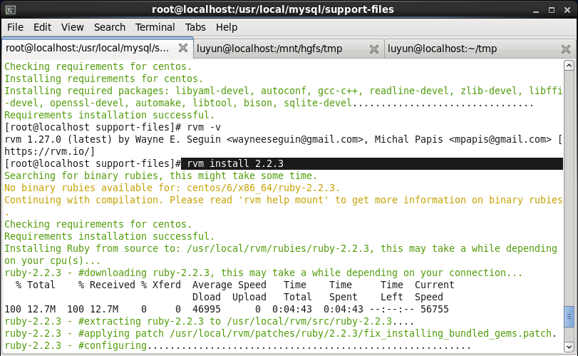

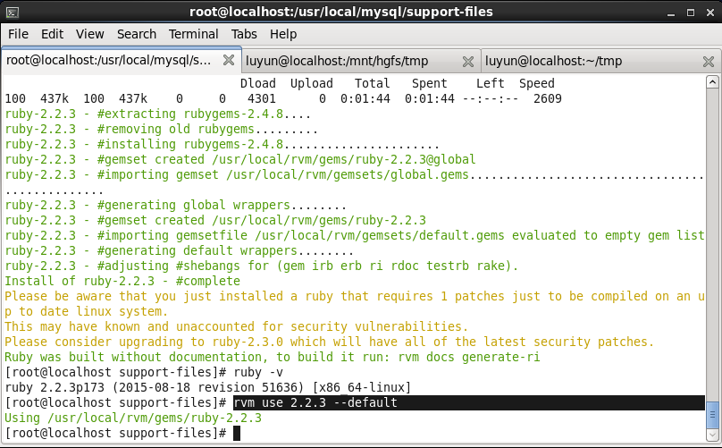

# 三、安装 nginx
- 3.1 安装 nginx
```bash
 gem install passenger
 passenger-install-nginx-module

# 安装过程中有以下交互
# Which languages are you interested in?		回车
# Automatically download and install Nginx?		1回车
# Where do you want to install Nginx to?		回车
# Press ENTER to continue.		回车

# 如果提示 缺少SSL 组件
# yum install libcurl-devel
```

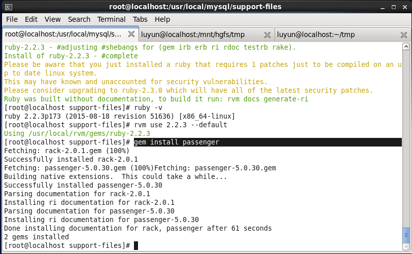

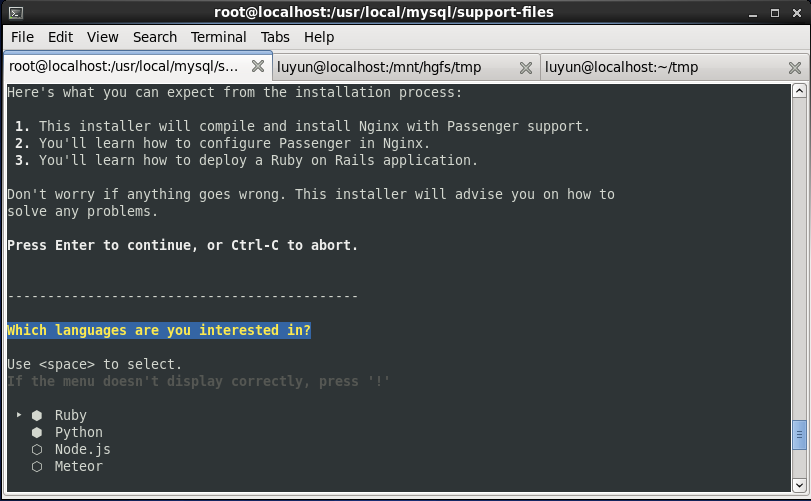


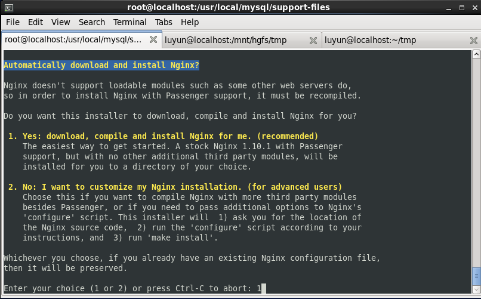


- 3.2 配置 nginx 服务
```
vim /opt/nginx/conf/nginx.conf
```

```bash
# 将此代码粘贴到 nginx.conf
# 注意： 有两处需要修改为自己的 ssl key 地址

client_max_body_size 200M;
    server {
        listen       443 ssl;
        ssl                  on;
        ssl_certificate      /etc/ssl/private/cacert.pem; # 修改
        ssl_certificate_key  /etc/ssl/private/privkey.pem; # 修改

        ssl_session_timeout  5m;
        proxy_connect_timeout 300s;
        proxy_read_timeout 300s;
        proxy_send_timeout 300s;
        client_max_body_size 200M;

        ssl_protocols  SSLv2 SSLv3 TLSv1;
        ssl_ciphers  HIGH:!aNULL:!MD5;
        ssl_prefer_server_ciphers   on;

        root   /home/www/ryunkang/public; # 访问路径
        passenger_enabled on;
    }
```
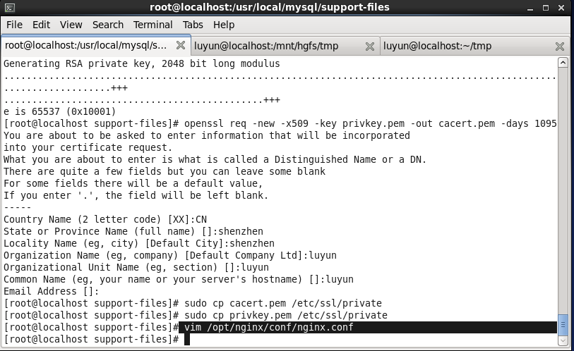

- 3.3 配置 nginx 命令
```
vim /etc/init.d/nginx
```

```bash
# 粘贴以下代码
#!/bin/sh
#nginx - this script starts and stops the nginx daemon
#
# Source function library.
. /etc/rc.d/init.d/functions
# Source networking configuration.
. /etc/sysconfig/network
# Check that networking is up.
[ "$NETWORKING" = "no" ] && exit 0
nginx="/opt/nginx/sbin/nginx" # nginx 程序位置
prog=$(basename $nginx)
NGINX_CONF_FILE="/opt/nginx/conf/nginx.conf" # nginx 配置位置

[ -f /etc/sysconfig/nginx ] && . /etc/sysconfig/nginx
lockfile=/var/lock/subsys/nginx
make_dirs() {
   user=`$nginx -V 2>&1 | grep "configure arguments:" | sed 's/[^*]*--user=\([^ ]*\).*/\1/g' -`
   if [ -z "`grep $user /etc/passwd`" ]; then
       useradd -M -s /bin/nologin $user
   fi
   options=`$nginx -V 2>&1 | grep 'configure arguments:'`
   for opt in $options; do
       if [ `echo $opt | grep '.*-temp-path'` ]; then
           value=`echo $opt | cut -d "=" -f 2`
           if [ ! -d "$value" ]; then
               mkdir -p $value && chown -R $user $value
           fi
       fi
   done
}
start() {
    [ -x $nginx ] || exit 5
    [ -f $NGINX_CONF_FILE ] || exit 6
    make_dirs
    echo -n $"Starting $prog: "
    daemon $nginx -c $NGINX_CONF_FILE
    retval=$?
    echo
    [ $retval -eq 0 ] && touch $lockfile
    return $retval
}
stop() {
    echo -n $"Stopping $prog: "
    killproc $prog -QUIT
    retval=$?
    echo
    [ $retval -eq 0 ] && rm -f $lockfile
    return $retval
}
restart() {
    configtest || return $?
    stop
    sleep 1
    start
}
reload() {
    configtest || return $?
    echo -n $"Reloading $prog: "
    killproc $nginx -HUP
    RETVAL=$?
    echo
}
force_reload() {
    restart
}
configtest() {
  $nginx -t -c $NGINX_CONF_FILE
}
rh_status() {
    status $prog
}
rh_status_q() {
    rh_status >/dev/null 2>&1
}
case "$1" in
    start)
        rh_status_q && exit 0
        $1
        ;;
    stop)
        rh_status_q || exit 0
        $1
        ;;
    restart|configtest)
        $1
        ;;
    reload)
        rh_status_q || exit 7
        $1
        ;;
    force-reload)
        force_reload
        ;;
    status)
        rh_status
        ;;
    condrestart|try-restart)
        rh_status_q || exit 0
            ;;
    *)
        echo $"Usage: $0 {start|stop|status|restart|condrestart|try-restart|reload|force-reload|configtest}"
        exit 2
esac
```
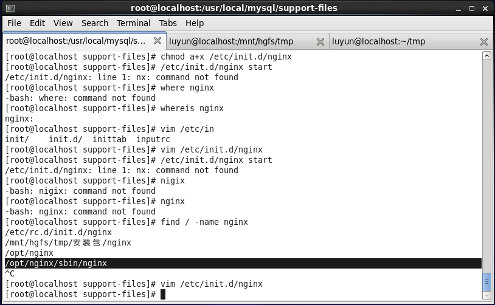

- 设置可执行权限

```bash
chmod a+x /etc/init.d/nginx

/etc/init.d/nginx start # 测试正常启动

/etc/init.d/nginx stop # 测试正常停止
```

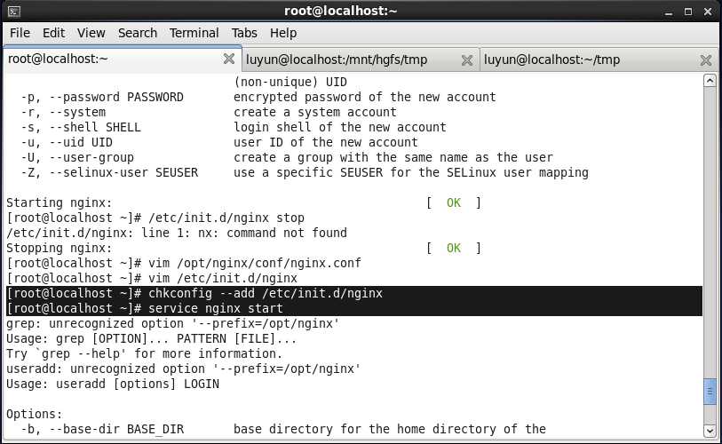

- 使用chkconfig进行管理
```bash
chkconfig --add /etc/init.d/nginx

service nginx start # 测试正常启动

service nginx stop # 测试正常停止

chkconfig nginx on # 设置开机自启
```

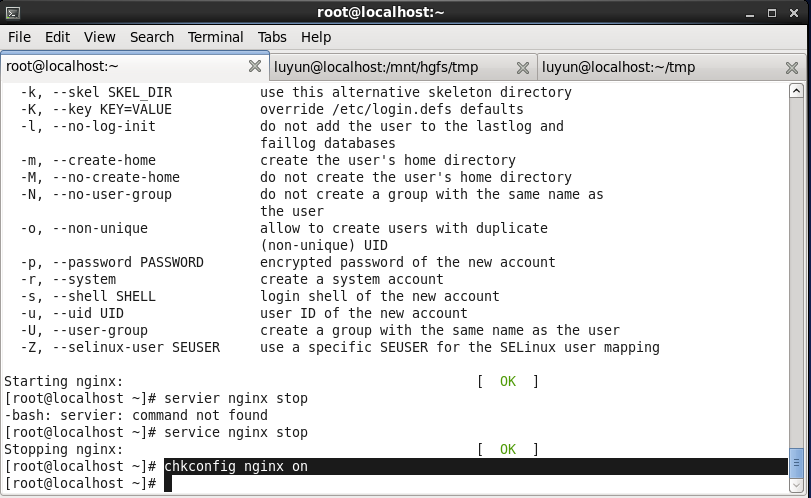


## 四、项目启动

- 解压项目包
```bash
cd /home/www # 进入 www 目录

tar xvfz ryunkang.tar.gz # 解压项目文件

cd ryunkang # 进入项目文件夹
```

- 安装依赖包
```bash
# 安装 bundler
gem install bundler

# 安装 ImageMagick
yum install ImageMagick
yum install ImageMagick-devel

# 安装依赖包
bundle install
```

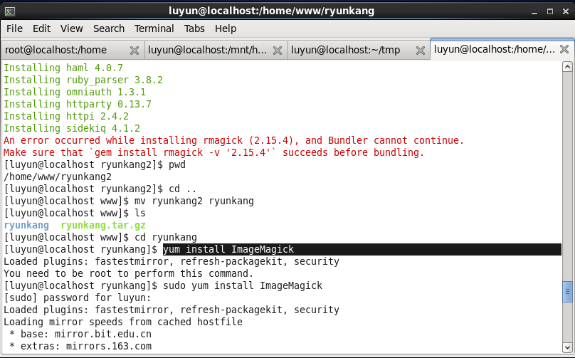

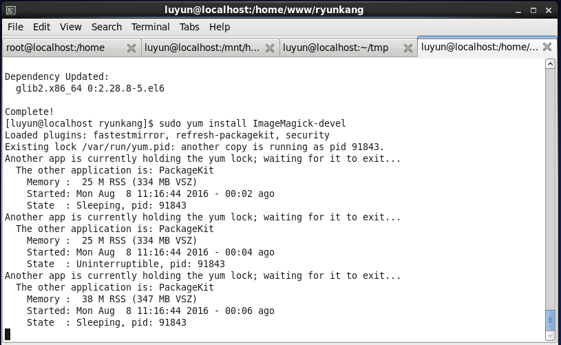

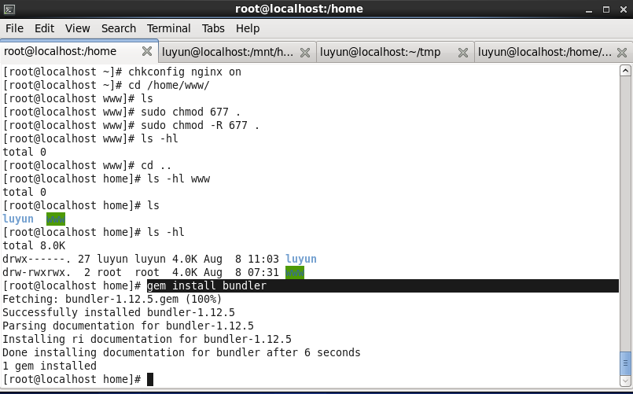


- 初始化数据库(只有首次执行）
```bash
sudo mkdir /usr/local/.db

sudo vi /usr/local/.db/mysql.pas # 输入mysql数据库密码

RAILS_ENV=production rake db:create db:migrate db:seed
```

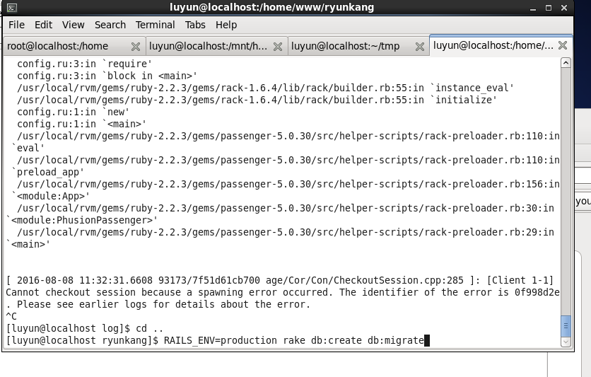

## 六、启动 nginx 服务器
```
sudo service nginx start
```

```ruby
# 浏览器访问
http://localhost:3000/

# 用户名：admin
# 密码：123456
```


